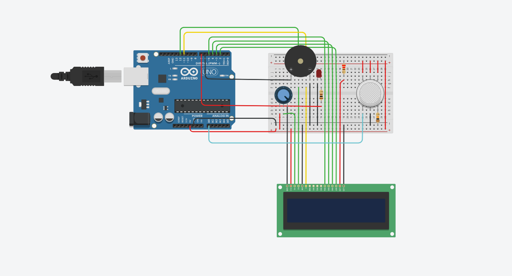

# Gas Sensor 

### Read this in [Portuguese](#versão-em-português)

This project uses a **gas sensor** connected to an **Arduino Uno**, with an **LCD display**, **LED**, and **buzzer** to detect and alert about high gas levels in the environment.

## Overview

The system reads data from the analog sensor and displays the current gas level on a **16x2 LCD display**. When the value exceeds a defined threshold, a **red LED turns on** and a **buzzer sounds an alert**, indicating a dangerous level of gas.

##  Circuit Assembly



## Operation

See the project in action:


## Components Used

- Arduino Uno  
- Gas Sensor   
- 16x2 LCD Display (parallel connection)  
- LED (red)  
- Buzzer   
- Resistors  
- Jumper wires  
- Breadboard  
- Potentiometer (250kΩ) – for LCD contrast adjustment  

##  How It Works

- The sensor sends analog values to the Arduino.  
- The value is displayed in real-time on the LCD.  
- If the gas level exceeds `500` (adjustable threshold), the system triggers a **visual (LED)** and **audible (buzzer)** alert.

## Code

The code is in the `sensor_gas.ino` file. Key features:

- Uses the `LiquidCrystal` library to control the LCD.  
- Defines a gas limit (`gasThreshold = 500`).  
- Reads from the sensor on pin `A0`.  
- Triggers the LED on pin `7` and buzzer on pin `6` when needed.

## Example LCD Output

```
Gas Level:
432         // normal range
```

When the value exceeds 500:

```
Gas Level:
612   ALERT!
```

## Setup

1. Copy the code into the Arduino IDE.  
2. Upload it to your Arduino Uno.  
3. Connect the components as specified in the code.  
4. Power the board via USB or external source.  

# or

## View Online

You can view and simulate this project directly on Tinkercad:

[Open in Tinkercad](https://www.tinkercad.com/things/eEMZPNOTxpE-sensor-de-gas)

## Possible Improvements

- Send data via Wi-Fi (ESP8266) or Bluetooth.  
- Store readings on an SD card.  
- Integrate with home automation systems (e.g., IFTTT).  
- Add a button to reset the alert.  

## License

This project is for educational use and is open for modifications.

---

## Versão em Português

# Sensor de Gás 

Este projeto utiliza um **sensor de gás** conectado a um **Arduino Uno**, com **display LCD**, **LED** e **buzzer**, para detectar e alertar sobre níveis elevados de gás no ambiente. 

## Visão Geral

O sistema lê os dados do sensor analógico e exibe o nível atual de gás em um **display LCD 16x2**. Quando o valor ultrapassa um limite definido, um **LED vermelho acende** e um **buzzer emite um som de alerta**, indicando presença perigosa de gás.

##  Montagem do Projeto


## Funcionamento

Veja o projeto em ação:


## Componentes Utilizados

- Arduino Uno
- Sensor de Gás 
- Display LCD 16x2 (com conexão paralela)
- LED (vermelho)
- Buzzer 
- Resistores
- Jumpers
- Protoboard
- Potenciômetro (250kΩ) – para ajuste de contraste do LCD

## Funcionamento

- O sensor envia valores analógicos para o Arduino.
- O valor é exibido em tempo real no display.
- Se o nível de gás for superior a `500` (limite ajustável), o sistema emite um **alerta visual (LED)** e **sonoro (buzzer)**.

## Código

O código está no arquivo `sensor_gas.ino`. Principais pontos:

- Utiliza a biblioteca `LiquidCrystal` para controlar o display.
- Define um limite de gás (`gasLimite = 500`).
- Realiza a leitura do sensor na porta `A0`.
- Aciona o LED na porta `7` e o buzzer na `6` quando necessário.

## Exemplo de Saída no LCD

```
Nivel de Gas:
432         // valor dentro do normal
```

Quando o valor ultrapassa 500:

```
Nivel de Gas:
612   ALERTA!
```

## Instalação

1. Copie o código para o Arduino IDE.
2. Faça o upload para o seu Arduino Uno.
3. Conecte os componentes conforme indicado nos pinos do código.
4. Ligue a alimentação (USB ou fonte externa).

# ou

## Ver Online

Você pode visualizar e simular este projeto diretamente no Tinkercad:

[Acesse o projeto no Tinkercad](https://www.tinkercad.com/things/eEMZPNOTxpE-sensor-de-gas)


## Possíveis Melhorias

- Enviar dados via Wi-Fi (com ESP8266) ou Bluetooth.
- Armazenar leituras em cartão SD.
- Integrar com sistemas de automação residencial (ex: IFTTT).
- Adicionar botão para reset de alerta.

## Licença

Este projeto é de uso educacional e livre para modificações.

---

Desenvolvido por Gabryel Souza
